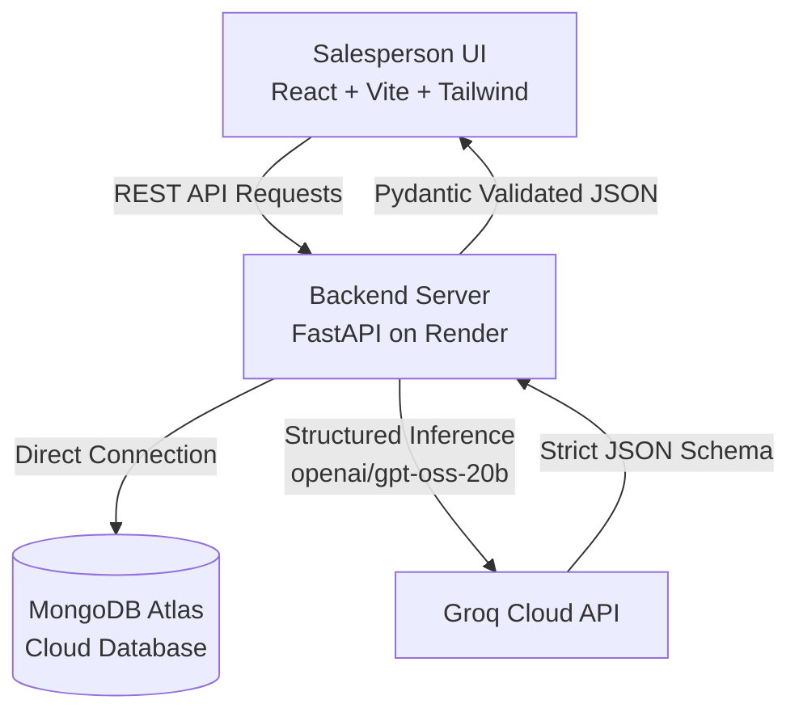

# LeadDesk — AI-Powered Lead Prioritization & Sales Copilot

[](https://lead-desk-navy.vercel.app/)
[](https://lead-desk-navy.vercel.app/)
[](https://github.com/aditya-1739/LeadDesk)
[](https://github.com/aditya-1739/LeadDesk)
[](https://groq.com/)

> **LeadDesk** is a purpose-built, salesperson-first AI lead management and sales acceleration platform designed for real estate professionals. It transforms unstructured customer inquiries from calls, WhatsApp, walk-ins, and web portals into ranked, actionable buyer intelligence in milliseconds.

🔗 **Live Application**: [https://lead-desk-navy.vercel.app/](https://lead-desk-navy.vercel.app/)

---

## 🎯 The Problem & The Solution

- **The Problem**: Real estate sales teams receive hundreds of customer inquiries across fragmented external channels. Salespeople spend hours manually reading through inconsistent messages, guessing buyer urgency, and wasting time on tire-kickers while high-intent, high-budget buyers slip through the cracks.
- **The Solution**: LeadDesk acts as an intelligent sales copilot. As soon as a lead is entered, the Groq-powered AI pipeline assesses 5 qualification dimensions, calculates an objective **Lead Priority Score (0–100)**, categorizes the lead as **`HOT`**, **`WARM`**, or **`COLD`**, reveals potential buyer objections, and synthesizes proactive follow-up recommendations.

---

## ✨ Key Features

### 🧠 1. Automated AI Lead Qualification & Deep Analysis
- **5-Signal Scoring Engine**: Evaluates **Intent Strength** (25%), **Timeline Urgency** (25%), **Budget Fit** (20%), **Requirement Clarity** (15%), and **Engagement Signal** (15%).
- **Categorization**: Instant classification into `HOT` (≥ 75), `WARM` (50–74), or `COLD` (< 50).
- **Executive Summaries**: Synthesizes the customer's property requirement, timeline, and exact budget into a concise summary.
- **Objections & Strategy**: Highlights red flags or buyer hesitations and provides a tailored recommended next action.

### 📋 2. Responsive Sales Dashboard & Card Grid
- **3-Column Responsive Grid**: Optimized card grid layout (`3 cols on desktop`, `2 cols on tablet`, `1 col on mobile`).
- **Priority Filter Tabs**: Real-time filtering by `[ ALL ]`, `[ HOT ]`, `[ WARM ]`, and `[ COLD ]` with live badge counts.
- **Multi-Field Sorting**: 8-way sorting engine:
  - *Priority Score*: High → Low / Low → High
  - *Date & Time*: Newest → Oldest / Oldest → Newest
  - *Budget*: Normalized numeric parsing (supports Lakhs, Crores, INR symbols)
  - *Buying Timeline*: Parsed into comparable day intervals (Immediate → 12+ Months)

### 📌 3. Personal Priority Queue ("My Priority")
- Separates algorithmic AI priority from individual salesperson focus.
- Salespeople can pin any lead to their personal queue with a single click (`+ Add to Priority` / `✓ In Priority`).
- Persists across sessions using browser-scoped storage with zero clutter.

### ⏰ 4. Actionable Follow-Up Engine ("Due Today")
- Salespeople can trigger AI follow-up plan generation on demand (`POST /api/leads/{id}/follow-up-plan`).
- Groq AI generates structured next steps (`action`, `dueAt`, `reason`) tailored to the lead's profile.
- Leads with active tasks automatically surface in the dedicated **Due Today** queue.

### ⚡ 5. Lead Lifecycle & Management
- **Mark Contacted**: Instantly updates lead status from `SUBMITTED` to `CONTACTED` with persistent timestamps.
- **Subtle 3-Dot Actions Menu (`⋮`)**: Clean, accessible dropdown on cards for `View Lead`, `Add/Remove from Priority`, and `Delete Lead`.
- **Destructive Deletion with Confirmation**: Built-in modal prevents accidental deletions; permanently purges lead and follow-up data from MongoDB without full page reloads.

### 🛡️ 6. Enterprise-Grade Security & Prompt Injection Defense
- Isolates raw, untrusted user inputs inside `<CUSTOMER_MESSAGE>` XML delimiters.
- Strict JSON Schema output guarantees using Groq structured outputs and Pydantic validation retry wrappers.

---

## 🏗️ Architecture & Tech Stack



| Layer | Technology | Details |
| :--- | :--- | :--- |
| **Frontend** | **React 18 + Vite + TypeScript** | Client-side routing-free state machine, zero heavy global state libs |
| **Styling** | **Tailwind CSS** | Custom responsive tokens, glassmorphism badges, mobile-responsive layout |
| **Backend** | **FastAPI + Python 3.11** | High-performance asynchronous REST API, Pydantic v2 schemas |
| **Database** | **MongoDB Atlas** | Document store with direct PyMongo connection, indexed sorting |
| **AI Inference** | **Groq Cloud API** | Ultra-low latency inference running `openai/gpt-oss-20b` |
| **Hosting** | **Vercel & Render** | Frontend on Vercel, Backend deployed on Render |

---

## 📊 AI Scoring Matrix

The prioritization score is computed through weighted deterministic aggregation of the 5 AI signal dimensions:

$$\text{Priority Score} = 0.25(I) + 0.25(T) + 0.20(B) + 0.15(C) + 0.15(E)$$

| Signal | Weight | Description |
| :--- | :---: | :--- |
| **Intent Strength ($I$)** | **25%** | Clarity of intent to buy vs casually browsing |
| **Timeline Urgency ($T$)** | **25%** | How immediately the client plans to close (Immediate, < 1 mo, 3-6 mos) |
| **Budget Fit ($B$)** | **20%** | Realistic capital allocation matching the stated property type & locality |
| **Requirement Clarity ($C$)** | **15%** | Precision of location, configuration (BHK, sqft), and amenities |
| **Engagement Signal ($E$)** | **15%** | Depth of detail provided in customer messages and inquiries |

```
Score >= 75  ──►  🔥 HOT   (Immediate priority, reach out within 15 mins)
Score 50-74  ──►  ⚡ WARM  (Active buyer, schedule discovery call)
Score < 50   ──►  ❄️ COLD  (Nurture campaign, long-term timeline)
```

---

## 📡 API Reference

| Method | Endpoint | Description |
| :--- | :--- | :--- |
| `GET` | `/api/health` | Health check probe |
| `POST` | `/api/leads` | Create new lead, run Groq AI analysis & scoring, save to MongoDB |
| `GET` | `/api/leads` | List all leads ranked by `priorityScore` descending |
| `GET` | `/api/leads/{id}` | Retrieve single lead and stored AI analysis |
| `PATCH` | `/api/leads/{id}/status` | Update lead status (`CONTACTED`) |
| `POST` | `/api/leads/{id}/follow-up-plan` | Generate AI follow-up recommendation and append to plan |
| `DELETE` | `/api/leads/{id}` | Permanently delete lead and its follow-ups from database |

---

## 🚀 Quickstart & Local Setup

### 1. Prerequisites
- **Node.js** (v18+ recommended)
- **Python** (v3.10+)
- **MongoDB Atlas** account (or local MongoDB on port 27017)
- **Groq API Key** (from [console.groq.com](https://console.groq.com))

---

### 2. Backend Setup

```bash
cd backend

# Create virtual environment
python -m venv venv

# Activate virtual environment
# Windows:
.\venv\Scripts\activate
# macOS/Linux:
source venv/bin/activate

# Install dependencies
pip install -r requirements.txt

# Configure environment variables
cp .env.example .env
```

Edit `backend/.env`:
```env
MONGODB_URI=mongodb+srv://<username>:<password>@cluster.mongodb.net/?retryWrites=true&w=majority
GROQ_API_KEY=gsk_your_groq_api_key_here
```

Start the FastAPI backend server:
```bash
uvicorn app.main:app --port 8000 --reload
```
API documentation will be available at `http://localhost:8000/docs`.

---

### 3. Frontend Setup

```bash
cd frontend

# Install dependencies
npm install

# Configure environment variables
# Create .env file:
echo "VITE_API_BASE_URL=http://localhost:8000" > .env

# Run local development server
npm run dev
```

Visit `http://localhost:5173` in your browser.

---

### 4. Seed Realistic Lead Data (Optional)

You can populate realistic real estate lead records to immediately test the AI analysis, sorting, and priority queues:

```bash
cd backend
python seed_leads.py
```

---

## 📁 Repository Structure

```text
LeadDesk/
├── backend/
│   ├── app/
│   │   ├── database/
│   │   │   └── mongodb.py         # PyMongo client & Atlas connection
│   │   ├── routes/
│   │   │   └── leads.py           # REST endpoints for leads & follow-ups
│   │   ├── schemas/
│   │   │   ├── analysis.py        # LeadAnalysis & ScoreSignal Pydantic models
│   │   │   └── lead.py            # Input & response Pydantic schemas
│   │   ├── services/
│   │   │   ├── ai.py              # Groq API integration & structured JSON schemas
│   │   │   └── scoring.py         # Priority scoring calculation & weighting
│   │   └── main.py                # FastAPI app initialization & CORS
│   ├── seed_leads.py              # Script to seed realistic test leads
│   └── requirements.txt           # Python dependencies
├── frontend/
│   ├── src/
│   │   ├── components/
│   │   │   ├── layout/
│   │   │   │   ├── AppShell.tsx   # Responsive application shell
│   │   │   │   ├── Header.tsx     # Top navbar with + Add Lead action
│   │   │   │   └── Sidebar.tsx    # Navigation (Leads, My Priority, Due Today)
│   │   │   └── leads/
│   │   │       ├── LeadDetail.tsx # Deep-dive AI analysis & quick actions
│   │   │       ├── LeadForm.tsx   # Lead intake modal with real-time AI status
│   │   │       └── LeadList.tsx   # 3-column responsive card grid & 3-dot menu
│   │   ├── pages/
│   │   │   └── Dashboard.tsx      # Main state controller, filter, sort & delete modal
│   │   ├── services/
│   │   │   └── api.ts             # Typed REST API client
│   │   ├── types/
│   │   │   └── lead.ts            # TypeScript interfaces
│   │   ├── App.tsx                # App root
│   │   └── main.tsx               # DOM entry point
│   ├── package.json
│   ├── tailwind.config.js
│   └── vite.config.ts
├── PROJECT_PROGRESS.md            # Detailed implementation log
└── README.md                      # Project documentation
```

---

## 🛡️ License

This project is open-source and available under the [MIT License](LICENSE).